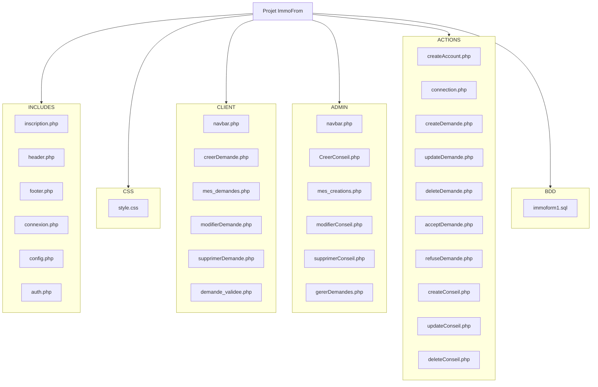
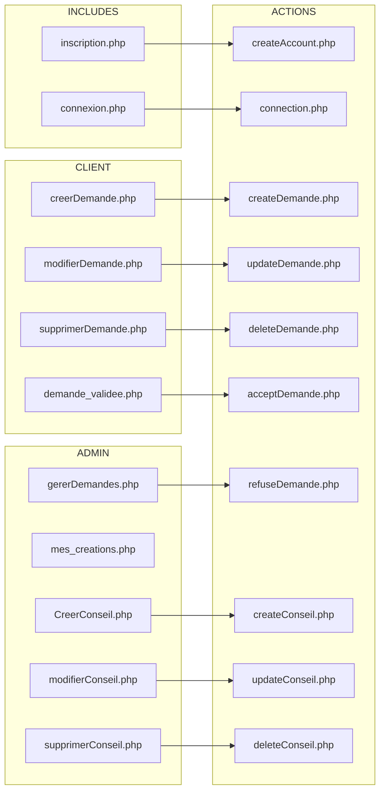

# Page de garde
- Page de connection (formulaire)
- Page d'inscription (formulaire)

## Client
- formulaire de demande de formation ou de conseil
- bouton permettant d'afficher l'historique des ses demandes
- avec la possibilité de modifier ou annuler une demande
- bouton pour changer ses informations

## Admin
- visu sur la liste des demandes (avec choix)
- bouton changement statut demande
- formulaire de création de formation ou conseil (personnalisé)
- visu sur liste formation et conseil créé

## De jolie petits graphs ...

### Structure de fichier :

### Liens avec les actions :

